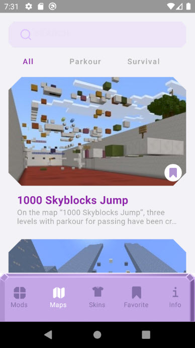
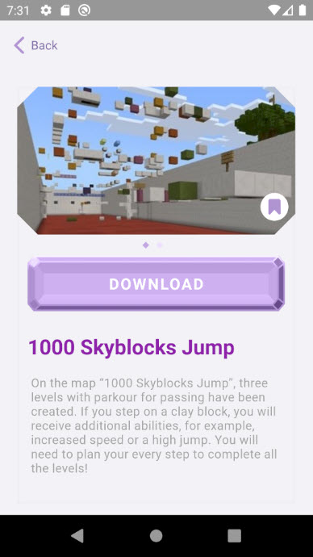
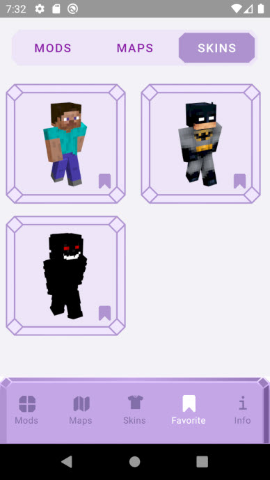

# MinecraApp (public page)

### About the project
The MinecraApp allows you to download maps, mods, skins for MineCraft from Cloud and install it to the game. 

   
   
  

### Warning
> Because of some rights for some materials, this project is not public and it could not be published in Google Play.
> So, this project is only for practicing of creating projects and some technologies.
> So if you want to look at the code, please **ask me to add you to a collaborator group** (for employers)

### Instruction to Install:
> Unfortunately, you can only download the project to open in Android Studio, but not run it. 
> It is because all data (mods, maps, skins) are stored in a personal Firebase cloud storage. And additionally it is not allowed to be public.

1. Ask me to add you to a collaborator group
2. Clone the project.
3. See all code

### Addition Info about the Project
#### Features that used in this project
Jetpack: 
* Navigation
* Shared ViewModel
* View Binding 
* DataStore - instead of SharedPreferences

Kotlin:
* Coroutine, Async
* Flow
* StateFlow - instead of LiveData

Storage:
* Cloud Firebase Storage - mods, maps, skins, info about every item are stored there

ID
* Dagger-Hilt

Other:
* Glide
* Gson

#### Strengths of the current project
* Navigation Component
* Used almost all main Jetpack components
* All data stored in Cloud
* Hilt DI
* Kotlin

#### Weakness of the current project
* Used only one shared ViewModel for all Fragments
* Some code duplication. Remake project for using generics with handling type erasure
* No dark mode and no landscape mode
